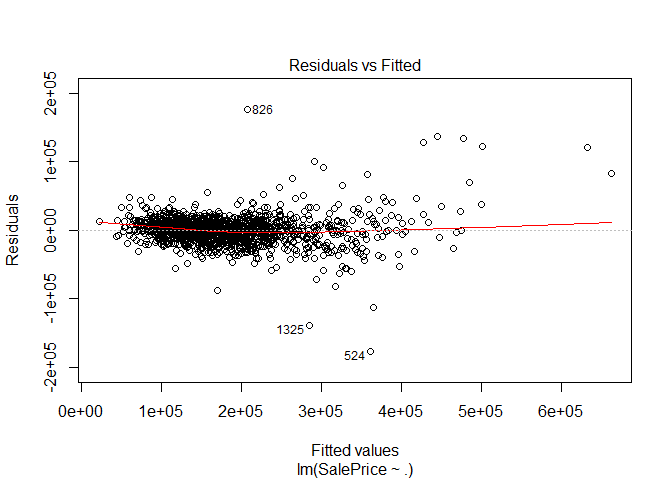
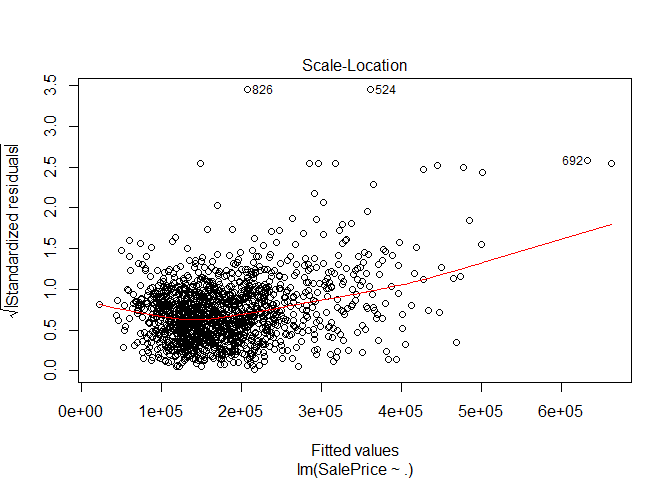
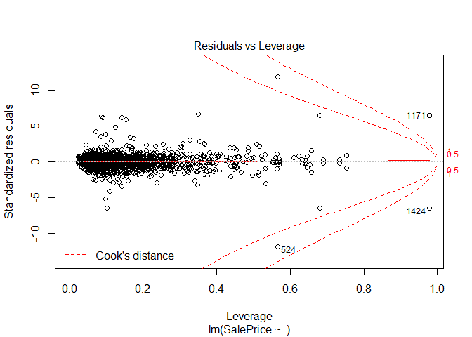
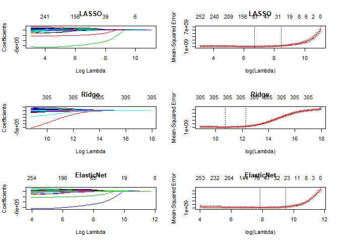

Linear Regression with House Prices
================

Kaggle - House Prices: Advanced Regression Techniques
-----------------------------------------------------

In the form of an open Kaggle competition, Kaggle has provided housing data with 79 attributes for residentail homes in Ames, Iowa. The goal is to predict the final price of each home. Here, we will focus on the application of linear, stepwise, and penalized regression models. It is worth noting that more time should be spent exploring the data and developing intuition. However, my goal here is to show the application of regression techniques.

Data
====

Now, lets take a look at some data - Kaggle provides us with two datasets labeled test and train, respectively. The idea here is to use the train dataset to fit a model and the test dataset to make predictions and submit a csv to be graded by Kaggle. Here is a view of the training set.

``` r
head(train)
```

    ##   Id MSSubClass MSZoning LotFrontage LotArea Street Alley LotShape
    ## 1  1         60       RL          65    8450   Pave  <NA>      Reg
    ## 2  2         20       RL          80    9600   Pave  <NA>      Reg
    ## 3  3         60       RL          68   11250   Pave  <NA>      IR1
    ## 4  4         70       RL          60    9550   Pave  <NA>      IR1
    ## 5  5         60       RL          84   14260   Pave  <NA>      IR1
    ## 6  6         50       RL          85   14115   Pave  <NA>      IR1
    ##   LandContour Utilities LotConfig LandSlope Neighborhood Condition1
    ## 1         Lvl    AllPub    Inside       Gtl      CollgCr       Norm
    ## 2         Lvl    AllPub       FR2       Gtl      Veenker      Feedr
    ## 3         Lvl    AllPub    Inside       Gtl      CollgCr       Norm
    ## 4         Lvl    AllPub    Corner       Gtl      Crawfor       Norm
    ## 5         Lvl    AllPub       FR2       Gtl      NoRidge       Norm
    ## 6         Lvl    AllPub    Inside       Gtl      Mitchel       Norm
    ##   Condition2 BldgType HouseStyle OverallQual OverallCond YearBuilt
    ## 1       Norm     1Fam     2Story           7           5      2003
    ## 2       Norm     1Fam     1Story           6           8      1976
    ## 3       Norm     1Fam     2Story           7           5      2001
    ## 4       Norm     1Fam     2Story           7           5      1915
    ## 5       Norm     1Fam     2Story           8           5      2000
    ## 6       Norm     1Fam     1.5Fin           5           5      1993
    ##   YearRemodAdd RoofStyle RoofMatl Exterior1st Exterior2nd MasVnrType
    ## 1         2003     Gable  CompShg     VinylSd     VinylSd    BrkFace
    ## 2         1976     Gable  CompShg     MetalSd     MetalSd       None
    ## 3         2002     Gable  CompShg     VinylSd     VinylSd    BrkFace
    ## 4         1970     Gable  CompShg     Wd Sdng     Wd Shng       None
    ## 5         2000     Gable  CompShg     VinylSd     VinylSd    BrkFace
    ## 6         1995     Gable  CompShg     VinylSd     VinylSd       None
    ##   MasVnrArea ExterQual ExterCond Foundation BsmtQual BsmtCond BsmtExposure
    ## 1        196        Gd        TA      PConc       Gd       TA           No
    ## 2          0        TA        TA     CBlock       Gd       TA           Gd
    ## 3        162        Gd        TA      PConc       Gd       TA           Mn
    ## 4          0        TA        TA     BrkTil       TA       Gd           No
    ## 5        350        Gd        TA      PConc       Gd       TA           Av
    ## 6          0        TA        TA       Wood       Gd       TA           No
    ##   BsmtFinType1 BsmtFinSF1 BsmtFinType2 BsmtFinSF2 BsmtUnfSF TotalBsmtSF
    ## 1          GLQ        706          Unf          0       150         856
    ## 2          ALQ        978          Unf          0       284        1262
    ## 3          GLQ        486          Unf          0       434         920
    ## 4          ALQ        216          Unf          0       540         756
    ## 5          GLQ        655          Unf          0       490        1145
    ## 6          GLQ        732          Unf          0        64         796
    ##   Heating HeatingQC CentralAir Electrical X1stFlrSF X2ndFlrSF LowQualFinSF
    ## 1    GasA        Ex          Y      SBrkr       856       854            0
    ## 2    GasA        Ex          Y      SBrkr      1262         0            0
    ## 3    GasA        Ex          Y      SBrkr       920       866            0
    ## 4    GasA        Gd          Y      SBrkr       961       756            0
    ## 5    GasA        Ex          Y      SBrkr      1145      1053            0
    ## 6    GasA        Ex          Y      SBrkr       796       566            0
    ##   GrLivArea BsmtFullBath BsmtHalfBath FullBath HalfBath BedroomAbvGr
    ## 1      1710            1            0        2        1            3
    ## 2      1262            0            1        2        0            3
    ## 3      1786            1            0        2        1            3
    ## 4      1717            1            0        1        0            3
    ## 5      2198            1            0        2        1            4
    ## 6      1362            1            0        1        1            1
    ##   KitchenAbvGr KitchenQual TotRmsAbvGrd Functional Fireplaces FireplaceQu
    ## 1            1          Gd            8        Typ          0        <NA>
    ## 2            1          TA            6        Typ          1          TA
    ## 3            1          Gd            6        Typ          1          TA
    ## 4            1          Gd            7        Typ          1          Gd
    ## 5            1          Gd            9        Typ          1          TA
    ## 6            1          TA            5        Typ          0        <NA>
    ##   GarageType GarageYrBlt GarageFinish GarageCars GarageArea GarageQual
    ## 1     Attchd        2003          RFn          2        548         TA
    ## 2     Attchd        1976          RFn          2        460         TA
    ## 3     Attchd        2001          RFn          2        608         TA
    ## 4     Detchd        1998          Unf          3        642         TA
    ## 5     Attchd        2000          RFn          3        836         TA
    ## 6     Attchd        1993          Unf          2        480         TA
    ##   GarageCond PavedDrive WoodDeckSF OpenPorchSF EnclosedPorch X3SsnPorch
    ## 1         TA          Y          0          61             0          0
    ## 2         TA          Y        298           0             0          0
    ## 3         TA          Y          0          42             0          0
    ## 4         TA          Y          0          35           272          0
    ## 5         TA          Y        192          84             0          0
    ## 6         TA          Y         40          30             0        320
    ##   ScreenPorch PoolArea PoolQC Fence MiscFeature MiscVal MoSold YrSold
    ## 1           0        0   <NA>  <NA>        <NA>       0      2   2008
    ## 2           0        0   <NA>  <NA>        <NA>       0      5   2007
    ## 3           0        0   <NA>  <NA>        <NA>       0      9   2008
    ## 4           0        0   <NA>  <NA>        <NA>       0      2   2006
    ## 5           0        0   <NA>  <NA>        <NA>       0     12   2008
    ## 6           0        0   <NA> MnPrv        Shed     700     10   2009
    ##   SaleType SaleCondition SalePrice
    ## 1       WD        Normal    208500
    ## 2       WD        Normal    181500
    ## 3       WD        Normal    223500
    ## 4       WD       Abnorml    140000
    ## 5       WD        Normal    250000
    ## 6       WD        Normal    143000

Lets take a look at the attributes provided in the dataset. A brief description of each can be found on the Data page for the Kaggle competition.

``` r
colnames(train)
```

    ##  [1] "Id"            "MSSubClass"    "MSZoning"      "LotFrontage"  
    ##  [5] "LotArea"       "Street"        "Alley"         "LotShape"     
    ##  [9] "LandContour"   "Utilities"     "LotConfig"     "LandSlope"    
    ## [13] "Neighborhood"  "Condition1"    "Condition2"    "BldgType"     
    ## [17] "HouseStyle"    "OverallQual"   "OverallCond"   "YearBuilt"    
    ## [21] "YearRemodAdd"  "RoofStyle"     "RoofMatl"      "Exterior1st"  
    ## [25] "Exterior2nd"   "MasVnrType"    "MasVnrArea"    "ExterQual"    
    ## [29] "ExterCond"     "Foundation"    "BsmtQual"      "BsmtCond"     
    ## [33] "BsmtExposure"  "BsmtFinType1"  "BsmtFinSF1"    "BsmtFinType2" 
    ## [37] "BsmtFinSF2"    "BsmtUnfSF"     "TotalBsmtSF"   "Heating"      
    ## [41] "HeatingQC"     "CentralAir"    "Electrical"    "X1stFlrSF"    
    ## [45] "X2ndFlrSF"     "LowQualFinSF"  "GrLivArea"     "BsmtFullBath" 
    ## [49] "BsmtHalfBath"  "FullBath"      "HalfBath"      "BedroomAbvGr" 
    ## [53] "KitchenAbvGr"  "KitchenQual"   "TotRmsAbvGrd"  "Functional"   
    ## [57] "Fireplaces"    "FireplaceQu"   "GarageType"    "GarageYrBlt"  
    ## [61] "GarageFinish"  "GarageCars"    "GarageArea"    "GarageQual"   
    ## [65] "GarageCond"    "PavedDrive"    "WoodDeckSF"    "OpenPorchSF"  
    ## [69] "EnclosedPorch" "X3SsnPorch"    "ScreenPorch"   "PoolArea"     
    ## [73] "PoolQC"        "Fence"         "MiscFeature"   "MiscVal"      
    ## [77] "MoSold"        "YrSold"        "SaleType"      "SaleCondition"
    ## [81] "SalePrice"

NA Values
---------

From the above we know that we have a dataset with mixed datatypes and NA values are present. Lets take a look at which columns contain NA values

``` r
colnames(train[colSums(is.na(train))>0])
```

    ##  [1] "LotFrontage"  "Alley"        "MasVnrType"   "MasVnrArea"  
    ##  [5] "BsmtQual"     "BsmtCond"     "BsmtExposure" "BsmtFinType1"
    ##  [9] "BsmtFinType2" "Electrical"   "FireplaceQu"  "GarageType"  
    ## [13] "GarageYrBlt"  "GarageFinish" "GarageQual"   "GarageCond"  
    ## [17] "PoolQC"       "Fence"        "MiscFeature"

Note that handling of NA and missing values is very important and can have an impact on the performance of a predictive model. Somes modelling techniques are better at handling NA values than others. For the sake of demonstrating the application of regression techniques, I am going to breeze over this otherwise very important topic.

In the light of brevity, we are simply going to dummy the dataframe to create columns for categorical attributes. In doing so, it also becomes apparent that we have three numerical features that contain NA values. We are going to set these to zero. In any other setting, it would be important to take the time and investigate each of the columns with NA values. There are several ways to handle missing and NA values, and taking the time to understand why they occur will allow the analyst to develop intuition and select appropriate techniques to handle such occurences.

Some of the other techniques for handling NA values include dropping rows/columns and imputation. When imputing the value of an NA, we can use simple calculations such as a mean and median, or we can even deploy other statistical learning techniques. K-NN, linear regression, and decision trees are other methods deployed in some wrapper classes such as caret. In a later writeup, we may explore the use of caret for the data science workflow.

``` r
library(dummies)
```

    ## dummies-1.5.6 provided by Decision Patterns

``` r
df <- dummy.data.frame(train)
colnames(df[colSums(is.na(df))>0])
```

    ## [1] "LotFrontage" "MasVnrArea"  "GarageYrBlt"

Since we have been provided test and train dataset to fit and score our models, we will need to combine them before dummying the data. If we do not do this step, we will produce an error when using the predict() function. We will add a column to identify each row by its original dataset. Likewise, we will add a column titled "SalePrice" to the test set - this is neccesary to maintain the correct dimensions when combining the test and train datasets.

``` r
df[is.na(df)]<- 0
```

``` r
# Combine datasets before preprocessing to ensure same columns during prediction 
train_df <- train
test_df <- test
train_df["dataset"]<- c("train")
test_df["SalePrice"]<- 0

test_df["dataset"]<- c("test")

df <- rbind(train_df,test_df)

# dummy data
df <- dummy.data.frame(df)

# 3 attributes are int and have nulls
colnames(df[colSums(is.na(df))>0])
```

    ##  [1] "LotFrontage"  "MasVnrArea"   "BsmtFinSF1"   "BsmtFinSF2"  
    ##  [5] "BsmtUnfSF"    "TotalBsmtSF"  "BsmtFullBath" "BsmtHalfBath"
    ##  [9] "GarageYrBlt"  "GarageCars"   "GarageArea"

``` r
str(df[colSums(is.na(df))>0])
```

    ## 'data.frame':    2919 obs. of  11 variables:
    ##  $ LotFrontage : int  65 80 68 60 84 85 75 NA 51 50 ...
    ##  $ MasVnrArea  : int  196 0 162 0 350 0 186 240 0 0 ...
    ##  $ BsmtFinSF1  : int  706 978 486 216 655 732 1369 859 0 851 ...
    ##  $ BsmtFinSF2  : int  0 0 0 0 0 0 0 32 0 0 ...
    ##  $ BsmtUnfSF   : int  150 284 434 540 490 64 317 216 952 140 ...
    ##  $ TotalBsmtSF : int  856 1262 920 756 1145 796 1686 1107 952 991 ...
    ##  $ BsmtFullBath: int  1 0 1 1 1 1 1 1 0 1 ...
    ##  $ BsmtHalfBath: int  0 1 0 0 0 0 0 0 0 0 ...
    ##  $ GarageYrBlt : int  2003 1976 2001 1998 2000 1993 2004 1973 1931 1939 ...
    ##  $ GarageCars  : int  2 2 2 3 3 2 2 2 2 1 ...
    ##  $ GarageArea  : int  548 460 608 642 836 480 636 484 468 205 ...

``` r
# replace with zero
df[is.na(df)]<-0
str(df[colSums(is.na(df))>0])
```

    ## 'data.frame':    2919 obs. of  0 variables

``` r
# Seperate test and train df
train <- df[df$datasettest %in% 0,]
test <- df[df$datasettest %in% 1,]


# remove added columns for test and train, sale price on test set
drop <- c("datasettest","datasettrain")
drop_sale <- c("SalePrice")

train <- train[, !(names(train) %in% drop)]
test <- test[, !(names(test) %in% drop)]
test <- test[, !(names(test) %in% drop_sale)]

# assignment to re use code
df <- train
```

Linear Regression
=================

For analysis, linear regression can be a powerful tool. When using linear regression to develop inference, several assumptions must be confirmed. Some of these assumptions include linearity, homoscedasticity, no autocorrelation, and no perfect multicollinearity. Assumptions can be checked using probability plots, specific tests such as the Durbin-Watson test for autocorellation, and calculations such as Variance Inflation Factor (VIF).

Since our goal here is prediction, we will start by loading a model with all attributes. If we were trying to pull inference from the data with a linear model, I would begin by inspecting simple models where we regress each variable against the dependent variable and test for non zero regression coefficients. Instead, we will load the full model and print the summary table where we see high r^2 value that might suggest overfitting.

``` r
fit <- lm(SalePrice ~ ., data = df)
summary(fit)$adj.r.squared
```

    ## [1] 0.9191775

A few observations are immediately apparent. First, the full model contains a large amount of attributes - 306 to be exact. Second, several of the attributes have NA as the coefficient. Lastly, the adjusted R-squared is almost .92!

Interpreting this initial model may not be feasible, yet alone desireable. With such a large adjusted-R squared, interesting behavior in the probability plot, and several outliers in the residual plot, it would not be a stretch to suggest that this model overfits the data. This is dangerous because overfitting our training data may lead to a model that does not generalize well.

``` r
summary(fit)
```

    ## 
    ## Call:
    ## lm(formula = SalePrice ~ ., data = df)
    ## 
    ## Residuals:
    ##     Min      1Q  Median      3Q     Max 
    ## -176870   -9090       0    9551  176870 
    ## 
    ## Coefficients: (58 not defined because of singularities)
    ##                        Estimate Std. Error t value Pr(>|t|)    
    ## (Intercept)           3.125e+05  1.047e+06   0.298 0.765400    
    ## Id                    1.102e+00  1.548e+00   0.712 0.476801    
    ## MSSubClass           -5.330e+01  8.274e+01  -0.644 0.519576    
    ## `MSZoningC (all)`    -2.167e+04  9.584e+03  -2.261 0.023907 *  
    ## MSZoningFV            1.104e+04  7.591e+03   1.454 0.146069    
    ## MSZoningRH            6.396e+02  7.573e+03   0.084 0.932705    
    ## MSZoningRL            3.312e+03  3.766e+03   0.879 0.379389    
    ## MSZoningRM                   NA         NA      NA       NA    
    ## MSZoningNA                   NA         NA      NA       NA    
    ## LotFrontage           7.008e+00  2.301e+01   0.305 0.760738    
    ## LotArea               7.230e-01  1.089e-01   6.640 4.73e-11 ***
    ## StreetGrvl           -3.326e+04  1.219e+04  -2.730 0.006430 ** 
    ## StreetPave                   NA         NA      NA       NA    
    ## AlleyGrvl             1.296e+03  4.212e+03   0.308 0.758317    
    ## AlleyPave             5.460e+02  4.739e+03   0.115 0.908298    
    ## AlleyNA                      NA         NA      NA       NA    
    ## LotShapeIR1          -1.675e+03  1.638e+03  -1.023 0.306560    
    ## LotShapeIR2           3.281e+03  4.331e+03   0.757 0.448925    
    ## LotShapeIR3           4.087e+03  8.854e+03   0.462 0.644472    
    ## LotShapeReg                  NA         NA      NA       NA    
    ## LandContourBnk       -5.446e+03  3.703e+03  -1.471 0.141644    
    ## LandContourHLS        2.122e+03  4.081e+03   0.520 0.603125    
    ## LandContourLow       -1.682e+04  5.700e+03  -2.951 0.003225 ** 
    ## LandContourLvl               NA         NA      NA       NA    
    ## UtilitiesAllPub       3.662e+04  2.636e+04   1.389 0.165067    
    ## UtilitiesNoSeWa              NA         NA      NA       NA    
    ## UtilitiesNA                  NA         NA      NA       NA    
    ## LotConfigCorner       1.634e+03  1.759e+03   0.929 0.353002    
    ## LotConfigCulDSac      9.485e+03  3.013e+03   3.148 0.001681 ** 
    ## LotConfigFR2         -6.267e+03  3.778e+03  -1.659 0.097441 .  
    ## LotConfigFR3         -1.585e+04  1.247e+04  -1.271 0.203945    
    ## LotConfigInside              NA         NA      NA       NA    
    ## LandSlopeGtl          4.228e+04  1.139e+04   3.712 0.000215 ***
    ## LandSlopeMod          4.974e+04  1.135e+04   4.381 1.28e-05 ***
    ## LandSlopeSev                 NA         NA      NA       NA    
    ## NeighborhoodBlmngtn   2.058e+02  1.048e+04   0.020 0.984337    
    ## NeighborhoodBlueste   7.298e+03  1.944e+04   0.375 0.707484    
    ## NeighborhoodBrDale   -2.505e+03  1.167e+04  -0.215 0.829989    
    ## NeighborhoodBrkSide  -5.624e+03  9.444e+03  -0.596 0.551578    
    ## NeighborhoodClearCr  -1.439e+04  9.557e+03  -1.505 0.132535    
    ## NeighborhoodCollgCr  -1.004e+04  8.253e+03  -1.217 0.223998    
    ## NeighborhoodCrawfor   1.188e+04  8.922e+03   1.331 0.183453    
    ## NeighborhoodEdwards  -2.134e+04  8.545e+03  -2.497 0.012662 *  
    ## NeighborhoodGilbert  -1.108e+04  8.643e+03  -1.282 0.200036    
    ## NeighborhoodIDOTRR   -1.185e+04  1.062e+04  -1.116 0.264732    
    ## NeighborhoodMeadowV  -6.944e+03  1.171e+04  -0.593 0.553450    
    ## NeighborhoodMitchel  -2.090e+04  8.757e+03  -2.387 0.017135 *  
    ## NeighborhoodNAmes    -1.719e+04  8.169e+03  -2.104 0.035563 *  
    ## NeighborhoodNoRidge   2.548e+04  9.046e+03   2.817 0.004929 ** 
    ## NeighborhoodNPkVill   1.362e+04  1.449e+04   0.940 0.347282    
    ## NeighborhoodNridgHt   1.849e+04  8.790e+03   2.104 0.035600 *  
    ## NeighborhoodNWAmes   -1.734e+04  8.399e+03  -2.065 0.039129 *  
    ## NeighborhoodOldTown  -1.415e+04  9.560e+03  -1.480 0.139073    
    ## NeighborhoodSawyer   -1.088e+04  8.466e+03  -1.285 0.199083    
    ## NeighborhoodSawyerW  -2.676e+03  8.482e+03  -0.316 0.752419    
    ## NeighborhoodSomerst  -2.288e+03  9.812e+03  -0.233 0.815613    
    ## NeighborhoodStoneBr   3.935e+04  9.525e+03   4.132 3.85e-05 ***
    ## NeighborhoodSWISU    -8.718e+03  1.013e+04  -0.861 0.389629    
    ## NeighborhoodTimber   -1.013e+04  9.068e+03  -1.117 0.264379    
    ## NeighborhoodVeenker          NA         NA      NA       NA    
    ## Condition1Artery     -1.159e+04  1.283e+04  -0.904 0.366354    
    ## Condition1Feedr      -4.476e+03  1.244e+04  -0.360 0.719035    
    ## Condition1Norm        4.743e+03  1.212e+04   0.391 0.695620    
    ## Condition1PosA       -1.269e+03  1.512e+04  -0.084 0.933152    
    ## Condition1PosN        3.492e+03  1.351e+04   0.258 0.796133    
    ## Condition1RRAe       -2.722e+04  1.461e+04  -1.863 0.062726 .  
    ## Condition1RRAn        1.171e+03  1.271e+04   0.092 0.926570    
    ## Condition1RRNe       -1.493e+04  2.071e+04  -0.721 0.471274    
    ## Condition1RRNn               NA         NA      NA       NA    
    ## Condition2Artery      2.147e+03  2.707e+04   0.079 0.936794    
    ## Condition2Feedr      -2.923e+03  2.114e+04  -0.138 0.890043    
    ## Condition2Norm       -7.721e+03  1.772e+04  -0.436 0.663115    
    ## Condition2PosA        4.628e+04  3.699e+04   1.251 0.211153    
    ## Condition2PosN       -2.363e+05  2.586e+04  -9.136  < 2e-16 ***
    ## Condition2RRAe       -1.267e+05  6.479e+04  -1.956 0.050749 .  
    ## Condition2RRAn       -2.069e+04  2.950e+04  -0.701 0.483280    
    ## Condition2RRNn               NA         NA      NA       NA    
    ## BldgType1Fam          1.551e+04  9.005e+03   1.722 0.085296 .  
    ## BldgType2fmCon        1.206e+04  7.610e+03   1.584 0.113360    
    ## BldgTypeDuplex        7.884e+03  8.733e+03   0.903 0.366848    
    ## BldgTypeTwnhs        -4.132e+03  5.000e+03  -0.826 0.408829    
    ## BldgTypeTwnhsE               NA         NA      NA       NA    
    ## HouseStyle1.5Fin     -3.587e+03  5.584e+03  -0.642 0.520801    
    ## HouseStyle1.5Unf      8.346e+03  8.890e+03   0.939 0.348046    
    ## HouseStyle1Story      1.684e+03  6.049e+03   0.278 0.780718    
    ## HouseStyle2.5Fin     -2.058e+04  1.366e+04  -1.506 0.132375    
    ## HouseStyle2.5Unf     -1.320e+04  1.006e+04  -1.313 0.189558    
    ## HouseStyle2Story     -9.443e+03  5.333e+03  -1.771 0.076893 .  
    ## HouseStyleSFoyer     -2.499e+03  5.503e+03  -0.454 0.649769    
    ## HouseStyleSLvl               NA         NA      NA       NA    
    ## OverallQual           6.850e+03  1.015e+03   6.750 2.29e-11 ***
    ## OverallCond           5.765e+03  8.710e+02   6.619 5.43e-11 ***
    ## YearBuilt             3.211e+02  7.705e+01   4.168 3.30e-05 ***
    ## YearRemodAdd          1.051e+02  5.585e+01   1.881 0.060230 .  
    ## RoofStyleFlat        -9.937e+04  3.452e+04  -2.879 0.004063 ** 
    ## RoofStyleGable       -9.038e+04  2.995e+04  -3.018 0.002597 ** 
    ## RoofStyleGambrel     -8.717e+04  3.087e+04  -2.824 0.004820 ** 
    ## RoofStyleHip         -9.066e+04  2.998e+04  -3.024 0.002544 ** 
    ## RoofStyleMansard     -7.957e+04  2.957e+04  -2.691 0.007226 ** 
    ## RoofStyleShed                NA         NA      NA       NA    
    ## RoofMatlClyTile      -6.251e+05  5.329e+04 -11.730  < 2e-16 ***
    ## RoofMatlCompShg      -5.420e+04  1.138e+04  -4.765 2.12e-06 ***
    ## RoofMatlMembran       4.130e+04  3.472e+04   1.190 0.234477    
    ## RoofMatlMetal         1.029e+04  3.376e+04   0.305 0.760426    
    ## RoofMatlRoll         -6.622e+04  2.789e+04  -2.374 0.017730 *  
    ## `RoofMatlTar&Grv`    -5.271e+04  2.127e+04  -2.478 0.013352 *  
    ## RoofMatlWdShake      -6.225e+04  1.859e+04  -3.348 0.000838 ***
    ## RoofMatlWdShngl              NA         NA      NA       NA    
    ## Exterior1stAsbShng    1.007e+04  1.334e+04   0.755 0.450517    
    ## Exterior1stAsphShn   -1.525e+04  3.182e+04  -0.479 0.631764    
    ## Exterior1stBrkComm    6.582e+03  2.567e+04   0.256 0.797669    
    ## Exterior1stBrkFace    1.737e+04  7.806e+03   2.225 0.026249 *  
    ## Exterior1stCBlock    -1.022e+04  2.698e+04  -0.379 0.704858    
    ## Exterior1stCemntBd   -2.424e+03  1.565e+04  -0.155 0.876954    
    ## Exterior1stHdBoard   -3.256e+03  7.209e+03  -0.452 0.651572    
    ## Exterior1stImStucc   -1.342e+04  2.633e+04  -0.510 0.610396    
    ## Exterior1stMetalSd    3.573e+03  9.976e+03   0.358 0.720298    
    ## Exterior1stPlywood   -4.150e+03  7.258e+03  -0.572 0.567596    
    ## Exterior1stStone      7.801e+03  2.173e+04   0.359 0.719679    
    ## Exterior1stStucco     2.360e+03  9.715e+03   0.243 0.808079    
    ## Exterior1stVinylSd   -4.444e+03  8.901e+03  -0.499 0.617715    
    ## `Exterior1stWd Sdng` -4.180e+03  6.683e+03  -0.625 0.531840    
    ## Exterior1stWdShing           NA         NA      NA       NA    
    ## Exterior1stNA                NA         NA      NA       NA    
    ## Exterior2ndAsbShng   -5.866e+03  1.245e+04  -0.471 0.637618    
    ## Exterior2ndAsphShn    6.592e+03  1.959e+04   0.336 0.736614    
    ## `Exterior2ndBrk Cmn` -7.024e+02  1.720e+04  -0.041 0.967425    
    ## Exterior2ndBrkFace   -1.588e+03  8.559e+03  -0.186 0.852800    
    ## Exterior2ndCBlock            NA         NA      NA       NA    
    ## Exterior2ndCmentBd    7.336e+03  1.523e+04   0.482 0.630079    
    ## Exterior2ndHdBoard    2.700e+03  6.785e+03   0.398 0.690776    
    ## Exterior2ndImStucc    1.168e+04  1.015e+04   1.151 0.250050    
    ## Exterior2ndMetalSd    4.942e+02  9.612e+03   0.051 0.959003    
    ## Exterior2ndOther     -2.382e+04  2.522e+04  -0.944 0.345176    
    ## Exterior2ndPlywood    1.066e+03  6.469e+03   0.165 0.869149    
    ## Exterior2ndStone     -1.588e+04  1.346e+04  -1.180 0.238313    
    ## Exterior2ndStucco     3.063e+02  9.225e+03   0.033 0.973517    
    ## Exterior2ndVinylSd    7.692e+03  7.930e+03   0.970 0.332301    
    ## `Exterior2ndWd Sdng`  6.519e+03  5.851e+03   1.114 0.265370    
    ## `Exterior2ndWd Shng`         NA         NA      NA       NA    
    ## Exterior2ndNA                NA         NA      NA       NA    
    ## MasVnrTypeBrkCmn     -2.209e+03  1.091e+04  -0.202 0.839624    
    ## MasVnrTypeBrkFace     1.983e+03  8.751e+03   0.227 0.820763    
    ## MasVnrTypeNone        4.999e+03  8.590e+03   0.582 0.560724    
    ## MasVnrTypeStone       6.800e+03  8.824e+03   0.771 0.441098    
    ## MasVnrTypeNA                 NA         NA      NA       NA    
    ## MasVnrArea            2.081e+01  5.789e+00   3.595 0.000338 ***
    ## ExterQualEx           1.992e+04  5.310e+03   3.751 0.000184 ***
    ## ExterQualFa           1.256e+04  9.762e+03   1.286 0.198542    
    ## ExterQualGd          -7.135e+02  2.458e+03  -0.290 0.771646    
    ## ExterQualTA                  NA         NA      NA       NA    
    ## ExterCondEx           3.930e+03  1.719e+04   0.229 0.819253    
    ## ExterCondFa           1.552e+03  5.786e+03   0.268 0.788498    
    ## ExterCondGd          -3.064e+03  2.391e+03  -1.282 0.200154    
    ## ExterCondPo           1.221e+04  2.630e+04   0.464 0.642652    
    ## ExterCondTA                  NA         NA      NA       NA    
    ## FoundationBrkTil      2.649e+04  1.473e+04   1.798 0.072369 .  
    ## FoundationCBlock      2.954e+04  1.451e+04   2.037 0.041908 *  
    ## FoundationPConc       3.052e+04  1.441e+04   2.119 0.034321 *  
    ## FoundationSlab        1.922e+04  1.730e+04   1.111 0.266737    
    ## FoundationStone       3.583e+04  1.826e+04   1.963 0.049934 *  
    ## FoundationWood               NA         NA      NA       NA    
    ## BsmtQualEx           -3.296e+04  3.622e+04  -0.910 0.363077    
    ## BsmtQualFa           -4.472e+04  3.601e+04  -1.242 0.214630    
    ## BsmtQualGd           -5.112e+04  3.600e+04  -1.420 0.155826    
    ## BsmtQualTA           -4.744e+04  3.590e+04  -1.322 0.186558    
    ## BsmtQualNA                   NA         NA      NA       NA    
    ## BsmtCondFa           -2.777e+03  4.240e+03  -0.655 0.512653    
    ## BsmtCondGd           -2.754e+03  3.247e+03  -0.848 0.396537    
    ## BsmtCondPo            6.570e+04  3.000e+04   2.190 0.028732 *  
    ## BsmtCondTA                   NA         NA      NA       NA    
    ## BsmtCondNA                   NA         NA      NA       NA    
    ## BsmtExposureAv        1.140e+04  2.298e+04   0.496 0.619977    
    ## BsmtExposureGd        2.569e+04  2.307e+04   1.113 0.265735    
    ## BsmtExposureMn        7.832e+03  2.305e+04   0.340 0.734046    
    ## BsmtExposureNo        6.250e+03  2.294e+04   0.273 0.785273    
    ## BsmtExposureNA               NA         NA      NA       NA    
    ## BsmtFinType1ALQ      -2.649e+03  2.915e+03  -0.909 0.363753    
    ## BsmtFinType1BLQ       1.531e+02  3.123e+03   0.049 0.960903    
    ## BsmtFinType1GLQ       3.045e+03  2.710e+03   1.123 0.261460    
    ## BsmtFinType1LwQ      -5.966e+03  3.771e+03  -1.582 0.113950    
    ## BsmtFinType1Rec      -2.479e+03  3.174e+03  -0.781 0.434828    
    ## BsmtFinType1Unf              NA         NA      NA       NA    
    ## BsmtFinType1NA               NA         NA      NA       NA    
    ## BsmtFinSF1            3.854e+01  5.324e+00   7.239 8.05e-13 ***
    ## BsmtFinType2ALQ       2.914e+04  2.496e+04   1.167 0.243284    
    ## BsmtFinType2BLQ       1.611e+04  2.470e+04   0.652 0.514453    
    ## BsmtFinType2GLQ       2.640e+04  2.548e+04   1.036 0.300395    
    ## BsmtFinType2LwQ       1.491e+04  2.473e+04   0.603 0.546666    
    ## BsmtFinType2Rec       1.887e+04  2.467e+04   0.765 0.444466    
    ## BsmtFinType2Unf       2.078e+04  2.461e+04   0.844 0.398755    
    ## BsmtFinType2NA               NA         NA      NA       NA    
    ## BsmtFinSF2            3.153e+01  9.054e+00   3.483 0.000514 ***
    ## BsmtUnfSF             2.101e+01  4.885e+00   4.301 1.84e-05 ***
    ## TotalBsmtSF                  NA         NA      NA       NA    
    ## HeatingFloor         -2.267e+04  2.973e+04  -0.762 0.445914    
    ## HeatingGasA          -1.333e+04  1.441e+04  -0.925 0.355150    
    ## HeatingGasW          -1.584e+04  1.550e+04  -1.022 0.306819    
    ## HeatingGrav          -2.120e+04  1.756e+04  -1.207 0.227595    
    ## HeatingOthW          -3.406e+04  2.347e+04  -1.451 0.147044    
    ## HeatingWall                  NA         NA      NA       NA    
    ## HeatingQCEx           3.257e+03  2.069e+03   1.574 0.115683    
    ## HeatingQCFa           3.796e+03  4.508e+03   0.842 0.399918    
    ## HeatingQCGd          -7.358e+02  2.171e+03  -0.339 0.734773    
    ## HeatingQCPo           5.597e+03  2.653e+04   0.211 0.832950    
    ## HeatingQCTA                  NA         NA      NA       NA    
    ## CentralAirN           1.722e+02  3.867e+03   0.045 0.964497    
    ## CentralAirY                  NA         NA      NA       NA    
    ## ElectricalFuseA      -1.019e+04  2.407e+04  -0.423 0.672173    
    ## ElectricalFuseF      -1.020e+04  2.447e+04  -0.417 0.676814    
    ## ElectricalFuseP      -1.845e+04  3.021e+04  -0.611 0.541561    
    ## ElectricalMix        -5.419e+04  5.056e+04  -1.072 0.284060    
    ## ElectricalSBrkr      -1.231e+04  2.387e+04  -0.516 0.606293    
    ## ElectricalNA                 NA         NA      NA       NA    
    ## X1stFlrSF             4.453e+01  5.639e+00   7.897 6.39e-15 ***
    ## X2ndFlrSF             6.221e+01  5.697e+00  10.920  < 2e-16 ***
    ## LowQualFinSF         -3.034e+00  1.904e+01  -0.159 0.873396    
    ## GrLivArea                    NA         NA      NA       NA    
    ## BsmtFullBath          1.554e+03  1.979e+03   0.786 0.432270    
    ## BsmtHalfBath         -4.289e+02  3.025e+03  -0.142 0.887272    
    ## FullBath              3.619e+03  2.198e+03   1.646 0.099975 .  
    ## HalfBath              1.836e+03  2.097e+03   0.876 0.381419    
    ## BedroomAbvGr         -3.599e+03  1.362e+03  -2.642 0.008354 ** 
    ## KitchenAbvGr         -1.336e+04  5.692e+03  -2.346 0.019116 *  
    ## KitchenQualEx         2.245e+04  3.927e+03   5.715 1.38e-08 ***
    ## KitchenQualFa         2.937e+03  4.878e+03   0.602 0.547256    
    ## KitchenQualGd        -1.020e+03  2.150e+03  -0.475 0.635147    
    ## KitchenQualTA                NA         NA      NA       NA    
    ## KitchenQualNA                NA         NA      NA       NA    
    ## TotRmsAbvGrd          1.761e+03  9.580e+02   1.838 0.066302 .  
    ## FunctionalMaj1       -1.776e+04  7.482e+03  -2.373 0.017781 *  
    ## FunctionalMaj2       -1.947e+04  1.246e+04  -1.563 0.118395    
    ## FunctionalMin1       -1.110e+04  4.762e+03  -2.332 0.019891 *  
    ## FunctionalMin2       -9.588e+03  4.653e+03  -2.061 0.039540 *  
    ## FunctionalMod        -2.358e+04  7.702e+03  -3.062 0.002247 ** 
    ## FunctionalSev        -5.923e+04  2.884e+04  -2.054 0.040212 *  
    ## FunctionalTyp                NA         NA      NA       NA    
    ## FunctionalNA                 NA         NA      NA       NA    
    ## Fireplaces            6.305e+03  2.562e+03   2.461 0.014012 *  
    ## FireplaceQuEx        -9.083e+03  6.235e+03  -1.457 0.145427    
    ## FireplaceQuFa        -9.678e+03  5.339e+03  -1.813 0.070145 .  
    ## FireplaceQuGd        -6.091e+03  3.422e+03  -1.780 0.075322 .  
    ## FireplaceQuPo         3.422e+03  6.380e+03   0.536 0.591836    
    ## FireplaceQuTA        -5.082e+03  3.578e+03  -1.420 0.155741    
    ## FireplaceQuNA                NA         NA      NA       NA    
    ## GarageType2Types      2.081e+04  1.189e+05   0.175 0.861117    
    ## GarageTypeAttchd      4.064e+04  1.187e+05   0.342 0.732196    
    ## GarageTypeBasment     4.496e+04  1.185e+05   0.379 0.704390    
    ## GarageTypeBuiltIn     4.054e+04  1.189e+05   0.341 0.733195    
    ## GarageTypeCarPort     4.582e+04  1.194e+05   0.384 0.701316    
    ## GarageTypeDetchd      4.356e+04  1.189e+05   0.366 0.714155    
    ## GarageTypeNA                 NA         NA      NA       NA    
    ## GarageYrBlt          -2.545e+01  6.088e+01  -0.418 0.676079    
    ## GarageFinishFin       6.281e+02  2.430e+03   0.258 0.796120    
    ## GarageFinishRFn      -1.758e+03  2.158e+03  -0.815 0.415340    
    ## GarageFinishUnf              NA         NA      NA       NA    
    ## GarageFinishNA               NA         NA      NA       NA    
    ## GarageCars            3.983e+03  2.280e+03   1.747 0.080813 .  
    ## GarageArea            1.852e+01  7.899e+00   2.345 0.019205 *  
    ## GarageQualEx          1.201e+05  2.987e+04   4.021 6.16e-05 ***
    ## GarageQualFa         -6.169e+03  4.866e+03  -1.268 0.205115    
    ## GarageQualGd         -1.251e+03  7.693e+03  -0.163 0.870868    
    ## GarageQualPo         -2.299e+04  2.394e+04  -0.960 0.337094    
    ## GarageQualTA                 NA         NA      NA       NA    
    ## GarageQualNA                 NA         NA      NA       NA    
    ## GarageCondEx         -1.145e+05  3.450e+04  -3.319 0.000929 ***
    ## GarageCondFa         -1.867e+03  5.407e+03  -0.345 0.729979    
    ## GarageCondGd         -2.434e+03  9.241e+03  -0.263 0.792272    
    ## GarageCondPo          3.969e+03  1.389e+04   0.286 0.775107    
    ## GarageCondTA                 NA         NA      NA       NA    
    ## GarageCondNA                 NA         NA      NA       NA    
    ## PavedDriveN           3.083e+02  3.463e+03   0.089 0.929084    
    ## PavedDriveP          -3.064e+03  4.864e+03  -0.630 0.528780    
    ## PavedDriveY                  NA         NA      NA       NA    
    ## WoodDeckSF            1.504e+01  5.873e+00   2.562 0.010542 *  
    ## OpenPorchSF           7.651e-01  1.157e+01   0.066 0.947280    
    ## EnclosedPorch         3.293e+00  1.248e+01   0.264 0.791898    
    ## X3SsnPorch            3.470e+01  2.237e+01   1.551 0.121125    
    ## ScreenPorch           3.536e+01  1.249e+01   2.830 0.004733 ** 
    ## PoolArea              6.742e+02  2.268e+02   2.973 0.003008 ** 
    ## PoolQCEx             -2.483e+05  1.226e+05  -2.025 0.043070 *  
    ## PoolQCFa             -4.056e+05  1.494e+05  -2.715 0.006724 ** 
    ## PoolQCGd             -3.767e+05  1.469e+05  -2.564 0.010458 *  
    ## PoolQCNA                     NA         NA      NA       NA    
    ## FenceGdPrv           -8.904e+03  3.671e+03  -2.426 0.015427 *  
    ## FenceGdWo            -8.501e+02  3.568e+03  -0.238 0.811698    
    ## FenceMnPrv            6.133e+02  2.268e+03   0.270 0.786889    
    ## FenceMnWw            -5.697e+03  7.466e+03  -0.763 0.445600    
    ## FenceNA                      NA         NA      NA       NA    
    ## MiscFeatureGar2      -1.566e+03  9.717e+04  -0.016 0.987147    
    ## MiscFeatureOthr       1.402e+04  2.019e+04   0.694 0.487741    
    ## MiscFeatureShed       2.374e+03  5.696e+03   0.417 0.676896    
    ## MiscFeatureTenC       2.988e+04  4.728e+04   0.632 0.527448    
    ## MiscFeatureNA                NA         NA      NA       NA    
    ## MiscVal               1.491e-01  6.110e+00   0.024 0.980539    
    ## MoSold               -4.671e+02  2.450e+02  -1.907 0.056798 .  
    ## YrSold               -5.467e+02  5.146e+02  -1.062 0.288243    
    ## SaleTypeCOD           4.639e+02  4.177e+03   0.111 0.911592    
    ## SaleTypeCon           2.570e+04  1.700e+04   1.512 0.130897    
    ## SaleTypeConLD         1.699e+04  8.866e+03   1.916 0.055610 .  
    ## SaleTypeConLI         4.970e+03  1.085e+04   0.458 0.646935    
    ## SaleTypeConLw         1.227e+03  1.134e+04   0.108 0.913789    
    ## SaleTypeCWD           1.520e+04  1.217e+04   1.249 0.211886    
    ## SaleTypeNew           2.179e+04  1.488e+04   1.465 0.143184    
    ## SaleTypeOth           7.222e+03  1.413e+04   0.511 0.609297    
    ## SaleTypeWD                   NA         NA      NA       NA    
    ## SaleTypeNA                   NA         NA      NA       NA    
    ## SaleConditionAbnorml  3.204e+02  1.483e+04   0.022 0.982765    
    ## SaleConditionAdjLand  9.794e+03  2.034e+04   0.481 0.630274    
    ## SaleConditionAlloca   1.583e+03  1.705e+04   0.093 0.926026    
    ## SaleConditionFamily   1.208e+03  1.559e+04   0.077 0.938272    
    ## SaleConditionNormal   7.023e+03  1.468e+04   0.478 0.632452    
    ## SaleConditionPartial         NA         NA      NA       NA    
    ## ---
    ## Signif. codes:  0 '***' 0.001 '**' 0.01 '*' 0.05 '.' 0.1 ' ' 1
    ## 
    ## Residual standard error: 22580 on 1205 degrees of freedom
    ## Multiple R-squared:  0.9332, Adjusted R-squared:  0.9192 
    ## F-statistic: 66.33 on 254 and 1205 DF,  p-value: < 2.2e-16

``` r
plot(fit)
```

    ## Warning: not plotting observations with leverage one:
    ##   121, 186, 251, 272, 326, 333, 347, 376, 399, 584, 596, 667, 811, 945, 949, 1004, 1012, 1188, 1231, 1271, 1276, 1299, 1322, 1371, 1380, 1387



    ## Warning: not plotting observations with leverage one:
    ##   121, 186, 251, 272, 326, 333, 347, 376, 399, 584, 596, 667, 811, 945, 949, 1004, 1012, 1188, 1231, 1271, 1276, 1299, 1322, 1371, 1380, 1387



    ## Warning in sqrt(crit * p * (1 - hh)/hh): NaNs produced

    ## Warning in sqrt(crit * p * (1 - hh)/hh): NaNs produced



Stepwise Regression
===================

One technique to reduce the amount of features or attributes in a regression model is to use stepwise regression. This technique uses an estimator of statistical quality to balance a trade off between model simplicity and model performance. Akaike or Bayes Information Criterion (AIC or BIC, respectively) are common estimators used in stepwise regression.

While stepwise regression can help with attribute selection, the methods used to perform the technique can be slow and not always exhaustive. Popular flavors include forward and backward selection, where attributes are either added or removed from the regression model and the selected criterion is calculated. For instance, when using backward stepwise with AIC, models are built and evaluated by AIC until a min AIC is determined. Once stopping conditions are reached, a subset of coefficients are returned by the stepwise regression.

Below, we create a linear model (lm) object with all attributes. This object is then used as an input for a backwards stepwise regression model and a stepwise model designated "both". For more information on both, use the R console to search ?stepAIC and the description for "direction".

``` r
# Full linear and stepwise models
library(MASS)
full <- lm(SalePrice ~ ., data = df)
step_mod <- stepAIC(full, direction = "backward", trace = FALSE)
step_both <- stepAIC(full, direction = "both", trace = FALSE)
```

``` r
summary(step_mod)$adj.r.squared
```

    ## [1] 0.9238193

Just like the full model, we see a suspiciously high value for the adjusted-R squared from the model selected by the backward stepwise regression. Moreover, the model ran for more than 40 minutes before arriving at its conclusion.

In comparison to the full model with 306 attributes, our stepwise regression model only has 123 attributes. While this may be an improvement in terms of selecting a more parsimonious model, a high adjusted-R squared still suggests overfitting.

``` r
# Attributes in stepwise model with backward select and AIC criteria
nrow(summary(step_mod)$coef)
```

    ## [1] 123

LASSO, Ridge, and Elastic Net Regression
========================================

Given that our initial linear regression model appears to overfit and has several (306) attributes, building a pertinent model from an inferencial standpoint may be a long, tedious, and perhaps unnecessary process. Penalized regression combined with cross-validation allows us to reduce overfitting and in return improve our ability to predict house prices.

Least Absolute Shrinkage and Selection Operator (LASSO) is a technique in regression that provides variable selection. The idea is reduce the size of coefficients so that the regression model generalizes better when applied to new data. I.e. to improve the prediction accuracy.

Ridge regression has similiar goals, however, Ridge regression will not set a coefficient to zero. As well, it is noted that Ridge regression can handle multicollinearity (Applied Predictive Modeling).

Elastic Net Regression allows us to utilize a combination of LASSO and Ridge penalties and tune for an effective combination of each to reduce error.

Here we begin by creating model matrices neccesary for cv.glmnet, the package we will use to perform penalized regression. We will then construct and plot the coefficient and error plots for LASSO, Ridge, and Elastic Net models. Lastly, we will loop through cv.glmnet to build models with alpha between 0 and 1. Alpha is the a tuning parameter that weights our penalized regression. At alpha = 0 we have a Ridge regression penalty and at alpha = 1 we have a LASSO penalty.

``` r
# Create Matrices
library(glmnet)
```

    ## Warning: package 'glmnet' was built under R version 3.4.3

    ## Loading required package: Matrix

    ## Loading required package: foreach

    ## Loaded glmnet 2.0-13

``` r
df2 <- df[,!names(df) %in% c("SalePrice")]
y <- as.matrix(df$SalePrice)
x <- as.matrix(as.data.frame(lapply(df2, as.numeric)))

# glmnet objects used for visulaizations
mod.lasso <- glmnet(x,y, family = "gaussian", alpha = 1)
mod.ridge <- glmnet(x,y, family = "gaussian", alpha = 0)
mod.enet <- glmnet(x,y, family = "gaussian", alpha = 0.5)

# Loop through cv.glmnet to produce models with alpa at each tenth from 0 to 1 
for (i in 0:10){
  assign(paste("mod",i,sep = ""), cv.glmnet(x,y, type.measure = "mse", alpha = i/10,
                                            family = "gaussian"))
}

# Plot
par(mfrow=c(3,2))
plot(mod.lasso, xvar = "lambda", main = "LASSO")
plot(mod10, main = "LASSO")

plot(mod.ridge, xvar = "lambda", main = "Ridge")
plot(mod0, main = "Ridge")

plot(mod.enet, xvar = "lambda", main = "ElasticNet")
plot(mod5, main = "ElasticNet")
```



From the plots above we see how the size of the coefficients increase as lambda increases. Likewise, we can see the mean-squared error (MSE) of each model as lambda and the amount of coefficients varies. The dotted lines on the MSE plot represent the standard error of the minimum lambda value for the best of each model.

In the following code, I am choosing to use lambda.1se to evaluate models. It is worth noting that lambda.min may give the best model, but it also may slightly overfit or be too complex. Instead, lambda.1se is the simplest model that has comparable error to the best model.

Lets count how many coefficients each model keeps:

``` r
nrow(coeff_mod10) # LASSO
```

    ## [1] 31

``` r
nrow(coeff_mod0) # Ridge
```

    ## [1] 306

``` r
nrow(coeff_mod5) # Elastic Net
```

    ## [1] 24

Now we have built the models how do we interpret which one is best? One way to evaluate the in sample performance of the penalized models is to look at the cvm and cvsd provided from cv.glmnet.

Cvm represents the cross-validated mean square error produced by each model. Cvsd represents the standard error for the cvm of each model. The idea is that the model with the lowest error will generalize best when tasked with prediction.

``` r
moddf <- c("Lasso","Ridge","ElasticNet")
lamda1se <- c(mod10$lambda.1se, mod0$lambda.1se, mod5$lambda.1se)
lamdamin <- c(mod10$lambda.min, mod0$lambda.min, mod5$lambda.min)
cvmMin <- c(min(mod10$cvm), min(mod0$cvm), min(mod5$cvm))
cvsdMin <- c(min(mod10$cvsd), min(mod0$cvsd), min(mod5$cvsd))
df_eval <- data.frame(moddf,lamda1se, lamdamin, cvmMin, cvsdMin)
df_eval
```

    ##        moddf   lamda1se   lamdamin     cvmMin   cvsdMin
    ## 1      Lasso   4642.559   792.6485  976713145 217231341
    ## 2      Ridge 215488.478 44315.4707 1053896192 182910948
    ## 3 ElasticNet  13471.115  2524.2410 1060991902 238089535

Comparing Results
=================

Test, train, and validate is a workflow that can be used in predictive modeling to produce, monitor, and hopefully improve results. So far, we have built models and evaluated them on in sample metrics such as r^2 or with calculations using sampling techniques (i.e. cross-validated mean error: cvm). Using the predict function, we can specify a trained model and a dataset to create predictions. I'll skip the code for brevity, but in the dataframes below we can see a comparison between the results of each of the models.

``` r
comp
```

    ##           Model Coeff adj.r2 cvm_error     cvsd
    ## 1        LinReg   255  0.919                   
    ## 2 Backward Step   123  0.924                   
    ## 3     Both Step   125  0.924                   
    ## 4         LASSO    31        976700000 2.17e+08
    ## 5         Ridge   306        1.054e+09 1.83e+08
    ## 6    ElasticNet    24        1.061e+09 2.38e+08

From above, we can rule out the linear regression (LinReg) and stepwise models since they have an unreasonably high adjusted-R squared as well as a large amount of coefficients. Looking at the penalized regression models, we want to choose a model with the best cross-validated mean error (cvm) and the smallest estimate of standard error for cvm (cvsd). Even though the LASSO and ElasticNet model produce a better cvm than the Ridge regression, we might expect the Ridge regression to perform better in prediction due to the amount of coefficients in the model. Deciding between the penalized models may be circumstantial to other requirements (i.e. Fitting and storing a model with 24 coefficients is less taxing than doing so with 306 coefficients). Finally, lets take a look at the scoring metric used by Kaggle. According to the competition webpage, "Submissions are evaluated on Root-Mean-Squared-Error (RMSE) between the logarithm of the predicted value and the logarithm of the observed sales price."

``` r
comp1<- data.frame(Model, Coeff, Metric)
comp1
```

    ##           Model Coeff  Metric
    ## 1        LinReg   255 0.19622
    ## 2 Backward Step   123 0.54674
    ## 3     Both Step   125 0.20231
    ## 4         LASSO    31 0.16560
    ## 5         Ridge   306 0.16154
    ## 6    ElasticNet    24 0.16495

Final Words
===========

In this write up we have attempted to predict housing prices in Ames, Iowa using a dataset provided by Kaggle. Quickly, we found that fitting a linear regression model to all attributes results in overfitting the dataset and poor predictive performance.

By using stepwise regression, we found that we could eliminate some of the attributes and produce a model with similiar adjusted-R squared as the larger linear model. However, this technique did not prevent overfitting the data and took a large amount of time to run. Further, the results of stepwise regression do not guarantee improvement. As seen in the results table above, our backwards stepwise regression actually presented a significant decrease in prediction performance, while our second stepwise model delivered similiar performance to the LinReg model.

By using penalized regression techniques, we have produced models that reduce overfitting and improve predictive performance. In the case of LASSO and Elast Net regression, we have been able to reduce the amount of attributes significantly to 24 from 306 while maintaining similiar predictive performance.

Lastly, we have briefly walked through the train, test, and validate portion of a datascience workflow. We took a look at in sample performance measures after fitting each model, we expanded our performance insight by using R's built in predict() function, and utilized Kaggles hidden dataset and error score for model validation. As expected, penalized regression techniques provided us with models that outperfrom the Ordinary Least Squares regression models.
