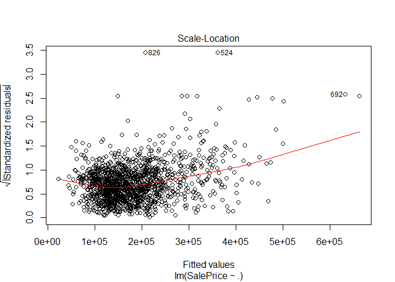
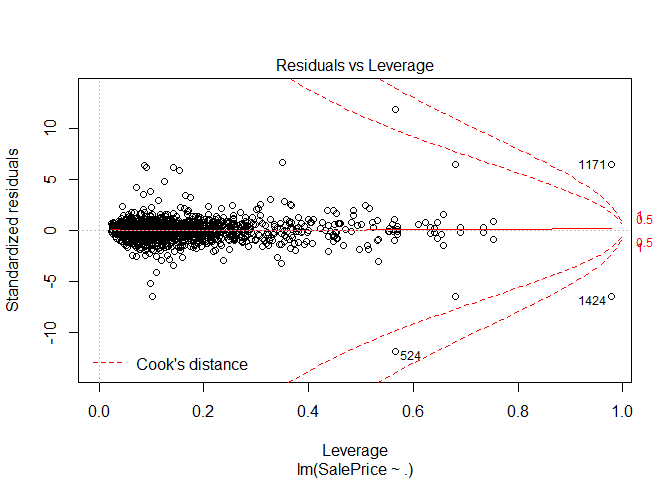
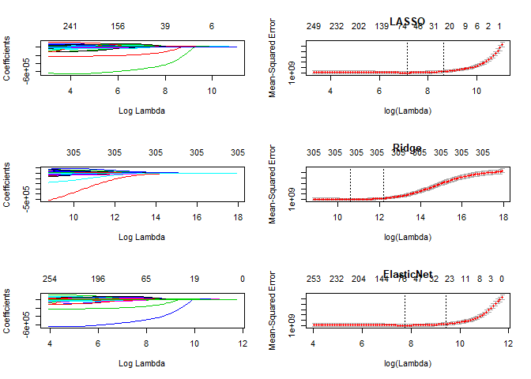

Linear Regression with Zillow House Prices
================

Introduction
------------

Zillow Group is a set of brands with a mission to "Build the largest, most trusted and vibrant home-related marketplace in the world". Within Zillow Group exists Zillow, a real estate and rental marketplace that seeks to empower consumers with data and knowledge throughout the home buying/renting lifecycle. Zillow's Zestimate is an estimated market value for an individual home that seeks to provide buyers and sellers with a viable starting point for home valuation.

Kaggle - House Prices: Advanced Regression Techniques
-----------------------------------------------------

In the form of an open Kaggle competition, Zillow has provided housing data with 79 attributes for residentail homes in Ames, Iowa. The goal is to predict the final price of each home. Here, we will focus on the application of linear, stepwise, and penalized regression models. It is worth noting that more time should be spent exploring the data and developing intuition. However, my goal here is to show the application of regression techniques.

Data
====

Now, lets take a look at some data - Kaggle provides us with two datasets labeled test and train, respectively. The idea here is to use the train dataset to fit a model and the test dataset to make predictions and submit a csv to be graded by Kaggle. Here is a view of the training set.

``` r
head(train)
```

    ##   Id MSSubClass MSZoning LotFrontage LotArea Street Alley LotShape
    ## 1  1         60       RL          65    8450   Pave  <NA>      Reg
    ## 2  2         20       RL          80    9600   Pave  <NA>      Reg
    ## 3  3         60       RL          68   11250   Pave  <NA>      IR1
    ## 4  4         70       RL          60    9550   Pave  <NA>      IR1
    ## 5  5         60       RL          84   14260   Pave  <NA>      IR1
    ## 6  6         50       RL          85   14115   Pave  <NA>      IR1
    ##   LandContour Utilities LotConfig LandSlope Neighborhood Condition1
    ## 1         Lvl    AllPub    Inside       Gtl      CollgCr       Norm
    ## 2         Lvl    AllPub       FR2       Gtl      Veenker      Feedr
    ## 3         Lvl    AllPub    Inside       Gtl      CollgCr       Norm
    ## 4         Lvl    AllPub    Corner       Gtl      Crawfor       Norm
    ## 5         Lvl    AllPub       FR2       Gtl      NoRidge       Norm
    ## 6         Lvl    AllPub    Inside       Gtl      Mitchel       Norm
    ##   Condition2 BldgType HouseStyle OverallQual OverallCond YearBuilt
    ## 1       Norm     1Fam     2Story           7           5      2003
    ## 2       Norm     1Fam     1Story           6           8      1976
    ## 3       Norm     1Fam     2Story           7           5      2001
    ## 4       Norm     1Fam     2Story           7           5      1915
    ## 5       Norm     1Fam     2Story           8           5      2000
    ## 6       Norm     1Fam     1.5Fin           5           5      1993
    ##   YearRemodAdd RoofStyle RoofMatl Exterior1st Exterior2nd MasVnrType
    ## 1         2003     Gable  CompShg     VinylSd     VinylSd    BrkFace
    ## 2         1976     Gable  CompShg     MetalSd     MetalSd       None
    ## 3         2002     Gable  CompShg     VinylSd     VinylSd    BrkFace
    ## 4         1970     Gable  CompShg     Wd Sdng     Wd Shng       None
    ## 5         2000     Gable  CompShg     VinylSd     VinylSd    BrkFace
    ## 6         1995     Gable  CompShg     VinylSd     VinylSd       None
    ##   MasVnrArea ExterQual ExterCond Foundation BsmtQual BsmtCond BsmtExposure
    ## 1        196        Gd        TA      PConc       Gd       TA           No
    ## 2          0        TA        TA     CBlock       Gd       TA           Gd
    ## 3        162        Gd        TA      PConc       Gd       TA           Mn
    ## 4          0        TA        TA     BrkTil       TA       Gd           No
    ## 5        350        Gd        TA      PConc       Gd       TA           Av
    ## 6          0        TA        TA       Wood       Gd       TA           No
    ##   BsmtFinType1 BsmtFinSF1 BsmtFinType2 BsmtFinSF2 BsmtUnfSF TotalBsmtSF
    ## 1          GLQ        706          Unf          0       150         856
    ## 2          ALQ        978          Unf          0       284        1262
    ## 3          GLQ        486          Unf          0       434         920
    ## 4          ALQ        216          Unf          0       540         756
    ## 5          GLQ        655          Unf          0       490        1145
    ## 6          GLQ        732          Unf          0        64         796
    ##   Heating HeatingQC CentralAir Electrical X1stFlrSF X2ndFlrSF LowQualFinSF
    ## 1    GasA        Ex          Y      SBrkr       856       854            0
    ## 2    GasA        Ex          Y      SBrkr      1262         0            0
    ## 3    GasA        Ex          Y      SBrkr       920       866            0
    ## 4    GasA        Gd          Y      SBrkr       961       756            0
    ## 5    GasA        Ex          Y      SBrkr      1145      1053            0
    ## 6    GasA        Ex          Y      SBrkr       796       566            0
    ##   GrLivArea BsmtFullBath BsmtHalfBath FullBath HalfBath BedroomAbvGr
    ## 1      1710            1            0        2        1            3
    ## 2      1262            0            1        2        0            3
    ## 3      1786            1            0        2        1            3
    ## 4      1717            1            0        1        0            3
    ## 5      2198            1            0        2        1            4
    ## 6      1362            1            0        1        1            1
    ##   KitchenAbvGr KitchenQual TotRmsAbvGrd Functional Fireplaces FireplaceQu
    ## 1            1          Gd            8        Typ          0        <NA>
    ## 2            1          TA            6        Typ          1          TA
    ## 3            1          Gd            6        Typ          1          TA
    ## 4            1          Gd            7        Typ          1          Gd
    ## 5            1          Gd            9        Typ          1          TA
    ## 6            1          TA            5        Typ          0        <NA>
    ##   GarageType GarageYrBlt GarageFinish GarageCars GarageArea GarageQual
    ## 1     Attchd        2003          RFn          2        548         TA
    ## 2     Attchd        1976          RFn          2        460         TA
    ## 3     Attchd        2001          RFn          2        608         TA
    ## 4     Detchd        1998          Unf          3        642         TA
    ## 5     Attchd        2000          RFn          3        836         TA
    ## 6     Attchd        1993          Unf          2        480         TA
    ##   GarageCond PavedDrive WoodDeckSF OpenPorchSF EnclosedPorch X3SsnPorch
    ## 1         TA          Y          0          61             0          0
    ## 2         TA          Y        298           0             0          0
    ## 3         TA          Y          0          42             0          0
    ## 4         TA          Y          0          35           272          0
    ## 5         TA          Y        192          84             0          0
    ## 6         TA          Y         40          30             0        320
    ##   ScreenPorch PoolArea PoolQC Fence MiscFeature MiscVal MoSold YrSold
    ## 1           0        0   <NA>  <NA>        <NA>       0      2   2008
    ## 2           0        0   <NA>  <NA>        <NA>       0      5   2007
    ## 3           0        0   <NA>  <NA>        <NA>       0      9   2008
    ## 4           0        0   <NA>  <NA>        <NA>       0      2   2006
    ## 5           0        0   <NA>  <NA>        <NA>       0     12   2008
    ## 6           0        0   <NA> MnPrv        Shed     700     10   2009
    ##   SaleType SaleCondition SalePrice
    ## 1       WD        Normal    208500
    ## 2       WD        Normal    181500
    ## 3       WD        Normal    223500
    ## 4       WD       Abnorml    140000
    ## 5       WD        Normal    250000
    ## 6       WD        Normal    143000

Lets take a look at the attributes provided in the dataset. A brief description of each can be found on the Data page for the Kaggle competition.

``` r
colnames(train)
```

    ##  [1] "Id"            "MSSubClass"    "MSZoning"      "LotFrontage"  
    ##  [5] "LotArea"       "Street"        "Alley"         "LotShape"     
    ##  [9] "LandContour"   "Utilities"     "LotConfig"     "LandSlope"    
    ## [13] "Neighborhood"  "Condition1"    "Condition2"    "BldgType"     
    ## [17] "HouseStyle"    "OverallQual"   "OverallCond"   "YearBuilt"    
    ## [21] "YearRemodAdd"  "RoofStyle"     "RoofMatl"      "Exterior1st"  
    ## [25] "Exterior2nd"   "MasVnrType"    "MasVnrArea"    "ExterQual"    
    ## [29] "ExterCond"     "Foundation"    "BsmtQual"      "BsmtCond"     
    ## [33] "BsmtExposure"  "BsmtFinType1"  "BsmtFinSF1"    "BsmtFinType2" 
    ## [37] "BsmtFinSF2"    "BsmtUnfSF"     "TotalBsmtSF"   "Heating"      
    ## [41] "HeatingQC"     "CentralAir"    "Electrical"    "X1stFlrSF"    
    ## [45] "X2ndFlrSF"     "LowQualFinSF"  "GrLivArea"     "BsmtFullBath" 
    ## [49] "BsmtHalfBath"  "FullBath"      "HalfBath"      "BedroomAbvGr" 
    ## [53] "KitchenAbvGr"  "KitchenQual"   "TotRmsAbvGrd"  "Functional"   
    ## [57] "Fireplaces"    "FireplaceQu"   "GarageType"    "GarageYrBlt"  
    ## [61] "GarageFinish"  "GarageCars"    "GarageArea"    "GarageQual"   
    ## [65] "GarageCond"    "PavedDrive"    "WoodDeckSF"    "OpenPorchSF"  
    ## [69] "EnclosedPorch" "X3SsnPorch"    "ScreenPorch"   "PoolArea"     
    ## [73] "PoolQC"        "Fence"         "MiscFeature"   "MiscVal"      
    ## [77] "MoSold"        "YrSold"        "SaleType"      "SaleCondition"
    ## [81] "SalePrice"

NA Values
=========

From the above we know that we have a dataset with mixed datatypes and NA values are present. Lets take a look at which columns contain NA values

``` r
colnames(train[colSums(is.na(train))>0])
```

    ##  [1] "LotFrontage"  "Alley"        "MasVnrType"   "MasVnrArea"  
    ##  [5] "BsmtQual"     "BsmtCond"     "BsmtExposure" "BsmtFinType1"
    ##  [9] "BsmtFinType2" "Electrical"   "FireplaceQu"  "GarageType"  
    ## [13] "GarageYrBlt"  "GarageFinish" "GarageQual"   "GarageCond"  
    ## [17] "PoolQC"       "Fence"        "MiscFeature"

Note that handling of NA and missing values is very important and can have an impact on the performance of a predictive model. Somes modelling techniques are better at handling NA values than others. For the sake of demonstrating the application of regression techniques, I am going to breeze over this otherwise very important topic.

In the light of brevity, we are simply going to dummy the dataframe to create columns for categorical attributes. In doing so, it also becomes apparent that we have three numerical features that contain NA values. We are going to set these to zero. In any other setting, it would be important to take the time and investigate each of columns with NA values. There are several ways to handle missing and NA values, and taking the time to understand why they occur will allow the analyst to develop intuition and select appropriate techniques to handle such occurences.

Some of the other techniques for handling NA values include dropping rows/columns and imputation. When imputing the value of an NA, we can use simple calculations such as a mean and median, or we can even deploy other statistical learning techniques. K-NN, linear regression, and decision trees are other methods deployed in some wrapper classes such as caret. In a later writeup, we may explore the use of caret for the data science workflow.

``` r
library(dummies)
```

    ## dummies-1.5.6 provided by Decision Patterns

``` r
df <- dummy.data.frame(train)
colnames(df[colSums(is.na(df))>0])
```

    ## [1] "LotFrontage" "MasVnrArea"  "GarageYrBlt"

For brevity, lets set NA values in the columns above to zero:

``` r
df[is.na(df)]<- 0
```

Linear Regression
=================

For analysis, linear regression can be a powerful tool. When using linear regression to develop inference, several assumptions must be confirmed. Some of these assumptions include linearity, homoscedasticity, no autocorrelation, and no perfect multicollinearity. Assumptions can be checked using probability plots, specific tests such as the Durbin-Watson test for autocorellation, and calculations such as Variance Inflation Factor (VIF).

Since our goal here is prediction, we will start by loading the full model. If we were trying to pull inference from the data with a linear model, I would begin by inspecting base models where we regress each variable against the dependent variable and test for non zero regression coefficients. Instead, we will load the full model and print the summary table where we see high r^2 value that might suggest overfitting.

``` r
fit <- lm(SalePrice ~ ., data = df)
summary(fit)$adj.r.squared
```

    ## [1] 0.9191775

A few observations are immediately apparent. First, the full model contains a large amount of attributes - 306 to be exact. Second, several of the attributes have NA as the coefficient. Lastly, the adjusted R-squared is almost .92!

``` r
plot(fit)
```

    ## Warning: not plotting observations with leverage one:
    ##   121, 186, 251, 272, 326, 333, 347, 376, 399, 584, 596, 667, 811, 945, 949, 1004, 1012, 1188, 1231, 1271, 1276, 1299, 1322, 1371, 1380, 1387


    ## Warning: not plotting observations with leverage one:
    ##   121, 186, 251, 272, 326, 333, 347, 376, 399, 584, 596, 667, 811, 945, 949, 1004, 1012, 1188, 1231, 1271, 1276, 1299, 1322, 1371, 1380, 1387



    ## Warning in sqrt(crit * p * (1 - hh)/hh): NaNs produced

    ## Warning in sqrt(crit * p * (1 - hh)/hh): NaNs produced



Interpreting this initial model may not be feasible, yet alone desireable. With such a large adjusted-R squared, interesting behavior in the probability plot, and several outliers in the residual plot, it would not be a stretch to suggest that this model overfits the data. This is dangerous because overfitting our training data may lead to a model that does not generalize well.

Stepwise Regression
===================

One technique to reduce the amount of features or attributes in a regression model is to use stepwise regression. This technique uses an estimator of statistical quality to balance a trade off between model simplicity and model performance. Akaike or Bayes Information Criterion (AIC or BIC, respectively) are the most common estimators used in stepwise regression.

While stepwise regression can help with attribute selection, the methods used to perform the technique can be slow and not always exhaustive. Popular flavors include forward and backward selection, where attributes are either added or removed from the regression model and the selected criterion is calculated. For instance, when using backward stepwise with AIC, models are built and evaluated by AIC until a min AIC is determined. Once stopping conditions are reached, a subset of coefficients are returned by the stepwise regression.

Since stepwise regression can be a timely process, we are going to use a basic dataset with columns containing NA values removed. This is for the illustration of stepwise regression - not a recommended workflow.

``` r
# build dataframe for stepwise
df_na <- train[colSums(is.na(train))>0]
to.remove <- c(colnames(df_na))
'%ni%' <- Negate('%in%')
df_step <- subset(train, select= names(train) %ni% to.remove)

# Full linear model
library(MASS)
full <- lm(SalePrice ~ ., data = df_step)
step <- stepAIC(full, direction = "backward", trace = FALSE )
step_lm <- lm(formula = SalePrice ~ MSZoning + LotArea + Street + LandContour + 
    LotConfig + LandSlope + Neighborhood + Condition1 + Condition2 + 
    BldgType + HouseStyle + OverallQual + OverallCond + YearBuilt + 
    YearRemodAdd + RoofStyle + RoofMatl + ExterQual + Foundation + 
    BsmtFinSF1 + BsmtFinSF2 + BsmtUnfSF + X1stFlrSF + X2ndFlrSF + 
    FullBath + BedroomAbvGr + KitchenAbvGr + KitchenQual + TotRmsAbvGrd + 
    Functional + Fireplaces + GarageCars + GarageArea + WoodDeckSF + 
    ScreenPorch + PoolArea + MoSold + SaleType, data = df_step)
summary(step_lm)$adj.r.squared
```

    ## [1] 0.9084505

Just like the full model, we see a suspiciously high value for the adjusted-R squared from the model selected by the backward stepwise regression. Moreover, with our dummied dataset, stepwise regression ran for more than 20 minutes before I decided to proceed with a simple example.

In comparison to the full model with 306 attributes, our stepwise regression model only has 123 attributes. While this may be an improvement in terms of selecting a more parsimonious model, a high adjusted-R squared still suggests overfitting.

``` r
# Attributes in stepwise model with backward select and AIC criteria
nrow(summary(step_lm)$coef)
```

    ## [1] 123

LASSO, Ridge, and Elastic Net Regression
========================================

Given that our initial linear regression model appears to overfit and has several (306) attributes, building a pertinent model from an inferencial standpoint may be a long, tedious, and perhaps unnecessary process. Penalized regression combined with cross-validation ....

Least Absolute Shrinkage and Selection Operator (LASSO) is a technique in regression that provides variable selection. The idea is reduce the size of coefficients so that the regression model generalizes better when applied to new data. I.e. to improve the prediction accuracy.

Ridge regression has similiar goals, however, Ridge will not set a coefficient to zero. It is noted that Ridge regression can handle collinear variables (Applied Predictive Modeling).

Elastic Net Regression allows use to utilize a combination of LASSO and Ridge penalties and tune for an effective combination of each to reduce error.

Here we begin by creating model matrices neccesary for cv.glmnet, the package we will use to perform penalized regression.

``` r
library(glmnet)
```

    ## Warning: package 'glmnet' was built under R version 3.4.3

    ## Loading required package: Matrix

    ## Loading required package: foreach

    ## Loaded glmnet 2.0-13

``` r
df2 <- df[,!names(df) %in% c("SalePrice")]
y <- as.matrix(df$SalePrice)
x <- as.matrix(as.data.frame(lapply(df2, as.numeric)))

mod.lasso <- glmnet(x,y, family = "gaussian", alpha = 1)
mod.ridge <- glmnet(x,y, family = "gaussian", alpha = 0)
mod.enet <- glmnet(x,y, family = "gaussian", alpha = 0.5)

# Loop through cv.glmnet to produce models with alpa as each tenth from 0 to 1 
for (i in 0:10){
  assign(paste("mod",i,sep = ""), cv.glmnet(x,y, type.measure = "mse", alpha = i/10,
                                            family = "gaussian"))
}

# Plot
par(mfrow=c(3,2))
plot(mod.lasso, xvar = "lambda")
plot(mod10, main = "LASSO")

plot(mod.ridge, xvar = "lambda")
plot(mod0, main = "Ridge")

plot(mod.enet, xvar = "lambda")
plot(mod5, main = "ElasticNet")
```



Specifically, lets count how many coefficients each model keeps at lambda.1se. We see that the LASSO model keeps 20, the Ridge keeps all 306, and the ElastiNet at alpah = 0.5 retains 31 attributes:

``` r
dim(coeff_mod10)
```

    ## [1] 28  1

``` r
dim(coeff_mod0) 
```

    ## [1] 306   1

``` r
dim(coeff_mod5)
```

    ## [1] 29  1

Now we have built the models how do we interpret which one is best? One way to evaluate the in sample performance of the penalized models is to look at the cvm and cvsd provided from cv.glmnet.

Before take a peak at the results, it is worth noting
